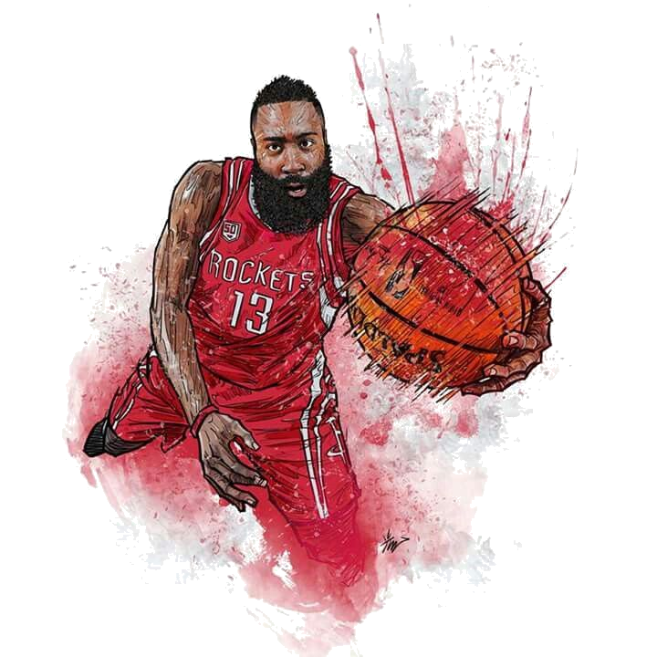

# Experiment Lab 🧪

## Objective

<i> * Create a portal for viewing game notes! </i>

## Features

<i> * React -> A JavaScript library for building user interfaces</i>

<i> * CSS -> Stylization of elements </i>

<i> * HTML -> Hypertext Markup Language </i>

## Get started

<i> * Install dependencies: <b>npm install</b></i>

<i> * Start the application: <b>npm start</b></i>

## Application

## Licensed

<i>Licensed under the Mit LICENSE in LICENSE.md </i>

